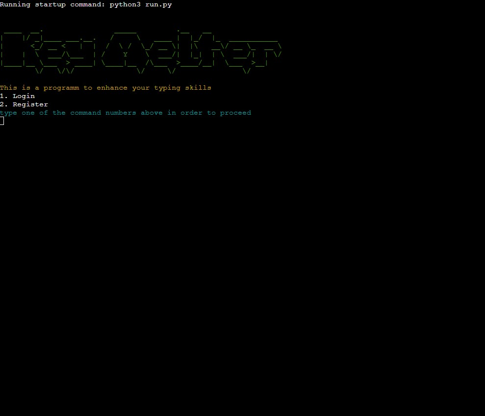
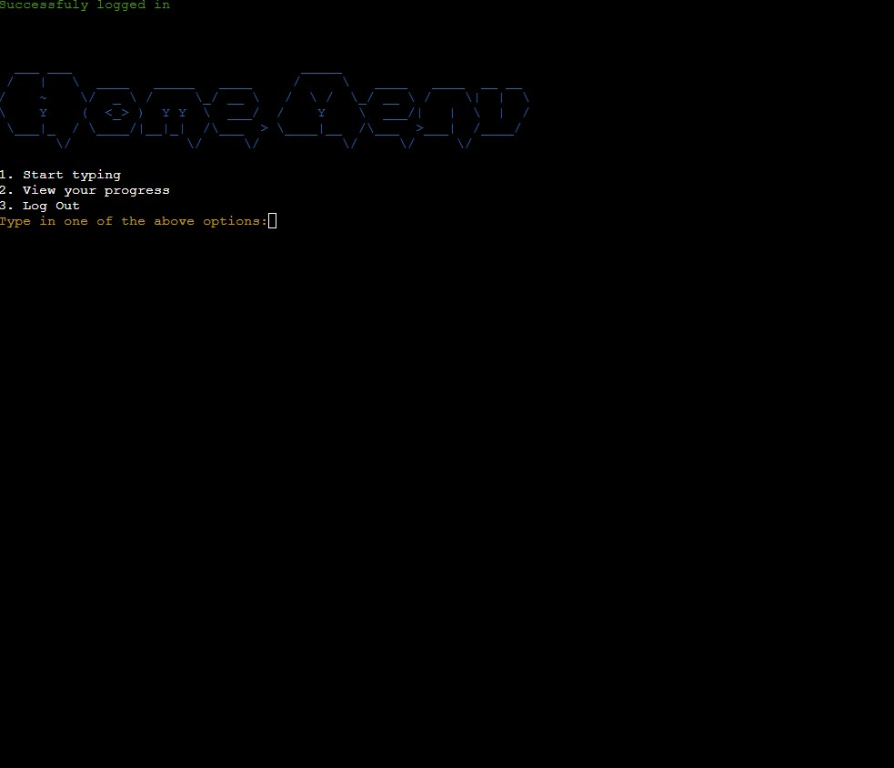
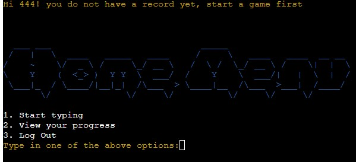
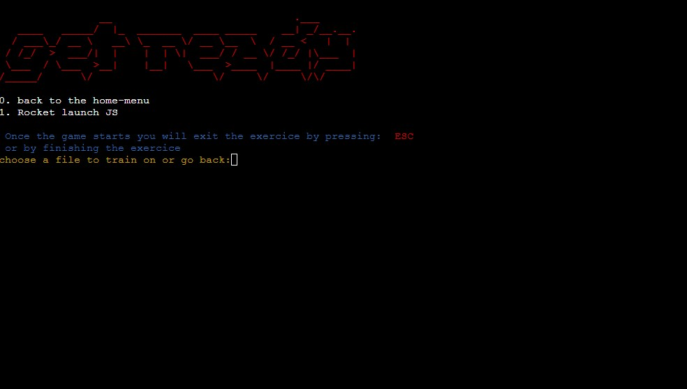
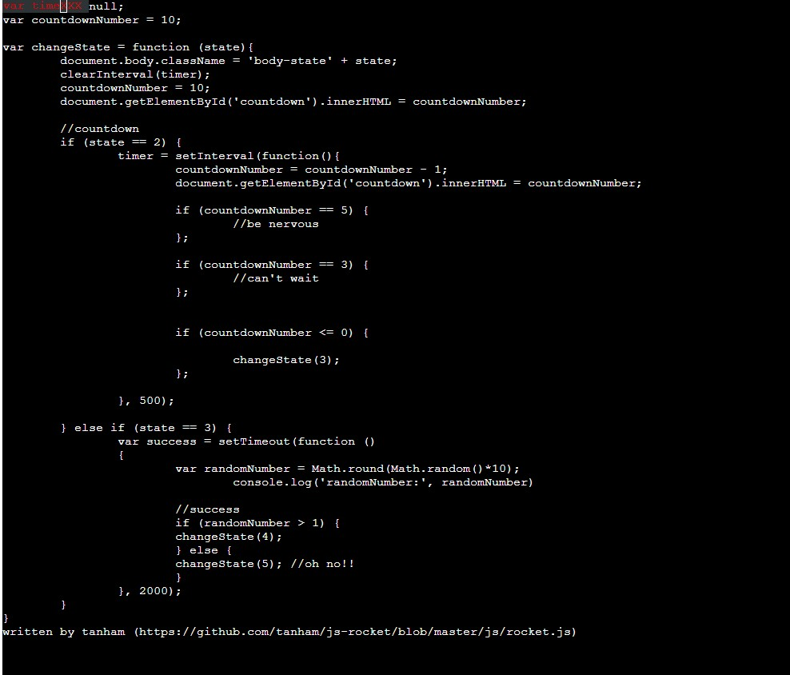
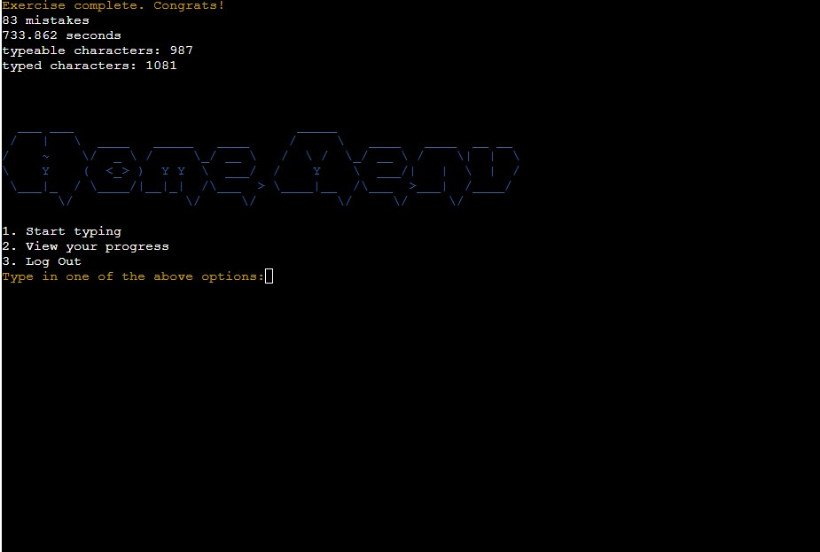
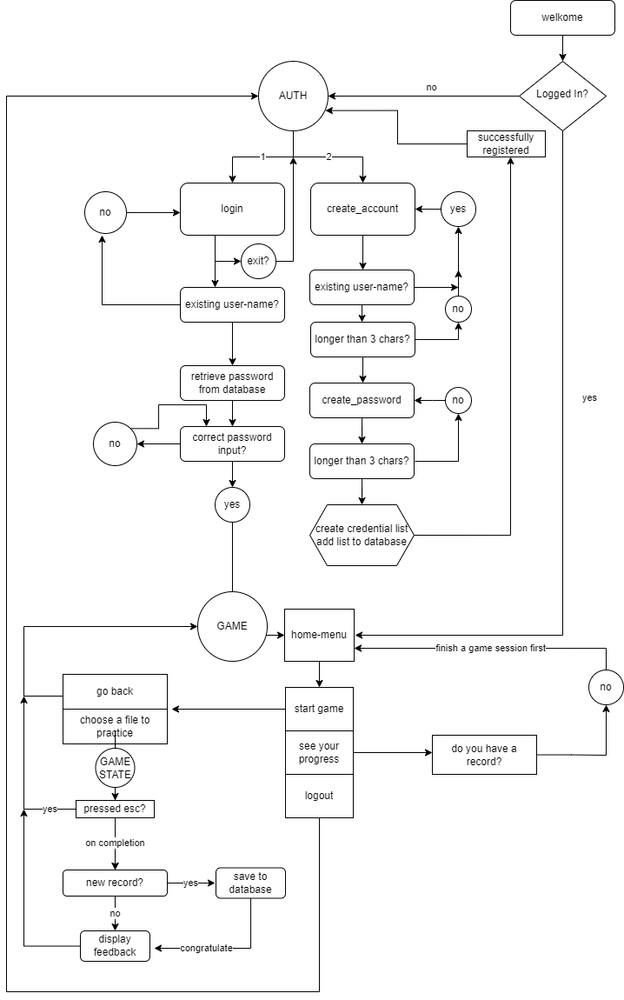
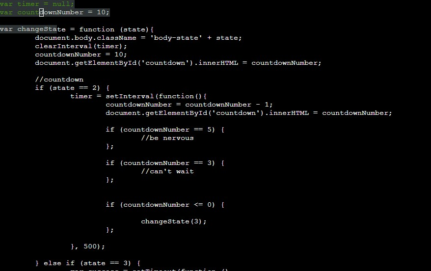

# Key Melter 
# A Type Practice Programm

### this is a pet-project that the developer will use to practice his typing skills in a programming environment, as the typing-skill is one of the best friends a programmer can have when composing, A' la' Prima.

###  just the same as a musician sings a melody for the first time like he's done it for a thousand times before, only because he has built a robust reading discipline. 
 
 

## [view live link](https://typinggame.herokuapp.com/)
 
 

## Table of contents
1.  [Project Mission](#project-mission)
    1. [User requirements](#user-requirements)
    2. [Developer Goal](#developer-goal)
2.  [User Manual](#user-manual)
3.  [Technical Design](#technical-design)
    1. [Flowchart](#flowchart-diagram-created-with-diagrammesio)
    2. [Data Models](#data-models)
4.  [Technologies Used](#technologies-used)
    1. [Python Language](#python-language)
    2. [modules and Tools](#python-requirements-and-modules)
5.  [Features](#features)
6.  [Following Features](#following-features)
7.  [Testing](#testing)
    1. [Development testing](#development-testing)
    2. [Formating](#formating)
    3. [Python Validation](#python-validation)
8.  [Bugs](#bugs)
    1. [Visual Bugs](#visual-bug)
    2. [Fixed Bugs](#fixed-bugs)
9.  [Deployment](#deployment)
10. [Credits](#credits)
10. [Acknowledgements](#acknowledgements)

## Project Mission
- ## The goal of the project is to provide a programming driven typing gamified exercise.
- ## User requirements
            - to be able to register a new account
            - to be able to login 
            - encrypted passwords
            - to see how many missed keys/mistakes were done
            - how many typeable characters are in the file (space-keys and enter-keys(\n) included)
            - how many characters were tiped (backspace included) 
            - the personal best record of the user to be stored in a database
            - to see the personal record over typing a document 
            - to see the results of an exercice even if it wasn't a record
            - to decreas the time, mistakes, and typed characters independendly, so each one of them get's updated relentless of the other
- ## Developer Goal
            - to do all of the above for a mutual benefit, as for this project, the developer will also be a user,
            - to find more features for making the program even better in the future, as the experience will demand a higher standard of training.
            - to build a robust useful and clean programm
## User Manual
- Authentication
    - 

    - when the program runs for the first time it presents two options:
        - login
        - register
    - once login or register is selected, a notification with "you can press exit in any of the following fields to return to the initial menu:
    - if login gets selected an input username: will come up
    - if your input matches your username in the database, an input password: will come up 
    - if you don't have an account yet, type exit instead and sellect register by pressing 2
    - when register is selected, create a unique username: will come up
    - if the username is not in the database, create a password: will come up.
    - if you don't want to register and login to an existent account instead, you can type in 
    exit and sellect login
    - all the fields need to be at least 3 characters long, if not, a red message will be displaied and the current input field will come up again.

- Home Menu:
    - 
    - there are 3 options here:
        - start typing
        - view your progress
        - log-out
    - when start typing is sellected, a list of documents to type on will come up
    - view your progress will display your current personal best record and if there is no record on your account yet, you will get a notification:
        - 
    - log out will return to the authentication menu

- Choose a file to type:
    - 
    - here are two current options:
        - go back to the home-menu
        - one file to type on (at the moment)
    - if the go back to home-menu is selected, the program will return at the home-menu on your account
    - when the rocket launch js file is sellected, a window will be displaied on the whole screen:
        - 
        - when typing the correct current letter the completed text will become green
        - when typing the wrong character, all the completed text will be red and an X will replace the missed character on the window, this get's repeated for maximum 5 times untill you can't advance anymore. from this position the only available option is to press BACKSPACE untill the text becomes green again
        - here you can also have the option to exit by pressing the ESC key, and return to the home-menu

        - when all the exercice is completed, you will receive a notification with:
            - your time spent on the exercice, 
            - the number of mistakes, 
            - the number of keys you pressed 
            - the number of minimum keys to be pressed
        also if you set a new personal best record, a notification will come up for each of the first 3 parameters above. congratulating you:
        - 
        - the home-menu will come up again, now you can see your account record or go for another round.

    
- ENJOY!! 
- <strong>IMPORTANT!!</strong> 
    - If the password on your account is forgotten, there currently is no way of resetting it through the programm. In this case you could send an email to bbranzaniuc53@gmail.com with your username and a short message with a context, or the link of the programm attached.

 
 

## Technical Design
1. ### Flowchart diagram created with [diagrammes.io](www.diagrammes.io)
    

Flowchart

    

     
2. ### Recursiveness
    - the Auth class is using a recursive flow in the majority of it's methods, as it was considered to be a more elegant way to handle the red-cases and insist on the desired outcome in the authentication process  

3. ### Curses Module
    - for the game_start() method of the Typing_state Class, the curses module was used, as the behaviour of the project requires the user to type over the specific coordinates of the file_map provided by typing_state.code_to_type_map(). 
    - [see curses documentation](https://docs.python.org/3/howto/curses.html)
4. ### Data models:
    - the project has 3 Classes :
        - Auth
            - hosts the authentication methods
        - Typing_state
            - hosts the typing map, matching and rendering logic
        - Game
            - gosts the menu navigation and type-game-initiation logic
    - 4 python files:
        - run.py
        - typing_state.py
        - game.py
        - auth.py

## Technologies Used
1. ### Python language
2. ### Python requirements and modules:
    1. ### requirements.txt
        - bcrypt==4.0.1
        - cachetools==5.2.1
        - colorama==0.4.6
        - getch==1.0
        - google-auth==2.16.0
        - google-auth-oauthlib==0.8.0
        - gspread==5.7.2
        - oauthlib==3.2.2
        - pwinput==1.0.2
        - pyasn1==0.4.8
        - pyasn1-modules==0.2.8
        - requests-oauthlib==1.3.1
        - rsa==4.9
        - termcolor==2.2.0   
3. [Ascii art generator](https://patorjk.com/software/taag/#p=display&h=2&v=1&f=Graffiti&t=Type%20Something%20) for ascii art titles
4. [black playground](https://black.vercel.app/?version=stable&state=_Td6WFoAAATm1rRGAgAhARYAAAB0L-Wj4ABlADtdAD2IimZxl1N_W1ktIvcnCRyz_JxMldeGP3FkYC4l_yCiOWfL-S4QrUMyitkDP-9TiRumVRC_cm_kkqQAAADz8W8IWfenugABV2bVuq1xH7bzfQEAAAAABFla) for code indentation
5. [python essential template](https://github.com/Code-Institute-Org/python-essentials-template) from [Code Institute](https://codeinstitute.net/ie/) for deploiment
## Features
    - register
    - login
    - password encryption
    - menu:
        - start game, 
        - see record,
        - log out
    - menu file selection:
        - go back
        - beggin tiping
        - display personal best record
        - constant user feedback throughout the usage of the programm
    - logout

 ## Following Features:
    1. Reset password with phone or email verification. Currently this option is not possible, however
    the user could send an email to bbranzaniuc53@gmail.com  with this requirement if needed (I will specify this in the user manual)
    
    2. the Game could track the missed keys whenever a mistake is made, and store them in a temporary manner or in a database. If in theory, every key on the key-board has it's own most efficient finger that needs to be pressed with, the program can give feedback based on the repeated missed keys regarding the theory of fast typing.
    
    3. An Api can be implemented to retrieve or build, source-code documents at random, based on a selected list of prefferences by the user. Typing and reading skills together will benefit from a bigger increase than typing over known documents. 

    4. Control + backspace needs to be added as a key-combination. It is proven to be more efficient to delete the whole word instead of pressing more than 2 backspaces.

## Testing
### Development Testing
1. during development of the three Classes, their methods were runned and tested independently, that way the end-points of each Object remained clear untill the final testing of the overall project. 
2. before and after each commit the functionality worked upon was tested for the expected result.
3. the final state of the project was testet by manual spam.
 ### Formating
1. all code was formatted with [black playground](https://black.vercel.app/?version=stable&state=_Td6WFoAAATm1rRGAgAhARYAAAB0L-Wj4ABlADtdAD2IimZxl1N_W1ktIvcnCRyz_JxMldeGP3FkYC4l_yCiOWfL-S4QrUMyitkDP-9TiRumVRC_cm_kkqQAAADz8W8IWfenugABV2bVuq1xH7bzfQEAAAAABFla)
 ### Python Validation
- [Pyton code validator](https://www.pythonchecker.com/) was used. an excelent result was given for all of the 4 python files of the programm: 
- run.py, 
- typing_state.py, 
- game.py, 
- auth.py

## Bugs
### Visual Bug
- in the curses window when rendering the completed user input over the map-document,
the background changes it's color and stays like that untill the window get's closed:

### Fixed Bugs
1. - The user couldn't go back once he decided to log-in or register, without restarting the programm, which was very frustrating
2. - before initialising the stdscr.keypad(True) in the courses module, while setting the ESC key to close the game window, a bunch of other keys like delete, end page-down, page-up, arrow-keys, F-keys were acting as Esc Does
3. - when in the game_state.game_start() running the game, if the esc key gets pressed, you return to the home-menu. after enabeling the keypad option in curses, the  stdscr.getkey() was returning '^[' and the esc_code variable was set to the same value: '^[' , but for some reason they were not equal even though the type of both was str.
- to check if the flow wasn't at fault, I changed the esc-code variable to 'a', and when pressing a the exiting was possible. 
- I fixed this issue by setting the esc_code variable to chr(27), which seemed to work perfectly

## Deployment
### The deployment of this project was made on the Heroku platform
- Config vars:
    - creds.json file
    - PORT 8000
- requirements:  requirements.txt file

- Followed the deployment model of [python essential template](https://github.com/Code-Institute-Org/python-essentials-template) from [Code Institute](https://codeinstitute.net/ie/)

## Credits
- The javascript document used for this project as a base for the exercise was written by [tanham](https://github.com/tanham)
- The HTML and JS code to create the terminal in a webpage were provided by [Code Institute](https://codeinstitute.net/ie/)
- The imported modules used were built and provided by the Python Comunity  
[tanham rocket.js github link](https://github.com/tanham/js-rocket/blob/master/js/rocket.js)
- The Python code was written by the developer, but many of the questions showing up in the learning and development process were answered by [stack-overflow](https://stackoverflow.com/) and [Tech With Tim youtube channel curses module video collection](https://www.youtube.com/@TechWithTim/search?query=curses)
- The game idea was inspired by the web-app [typing.io](https://typing.io/) 

## Acknowledgements
- I want to thank my Menthor Reuben for all the code reviews, ideas and support he offered me
- I also want to mention the comunity of [Code Institute](https://codeinstitute.net/ie/) and the Code Institute team itself for the continous support and hard work they are doing. 